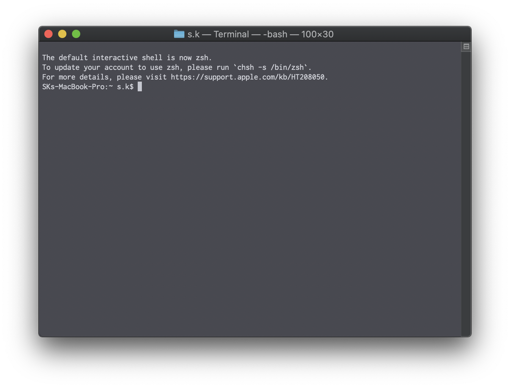

## Processing 修復方法

---

1. **ProcessingRepair.sh**をダウンロードし、デスクトップに置く。

2. アプリケーション一覧から**ターミナル**を開く。

3. このような画面が出ると思います。

    

4. ここからはターミナル上での作業になります。(コピペで構いません。)

   ```sh
   cd ~/desktop
   ```

   ```sh
   /bin/bash ProcessingRepair.sh
   ```

   途中パスワードを求められた場合はMacのログインパスワードを入力してください。

   なお、入力しても画面には表示されないので注意してください。
   
   これを順に実行すると、今までのProcessingのバックアップがデスクトップに作られます。
   
   

